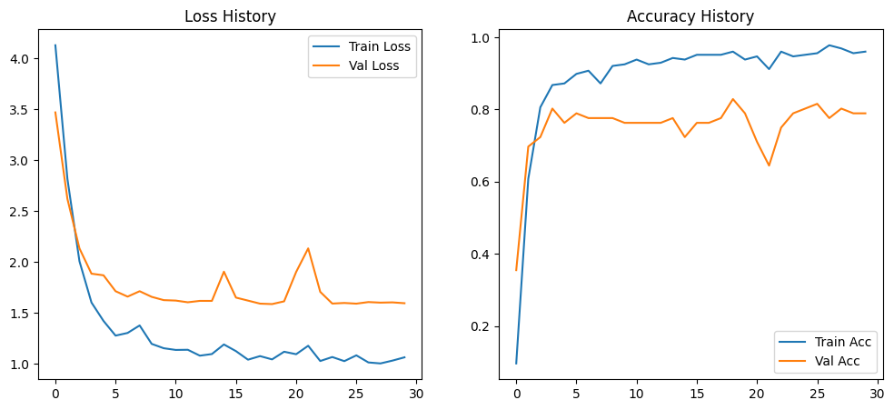
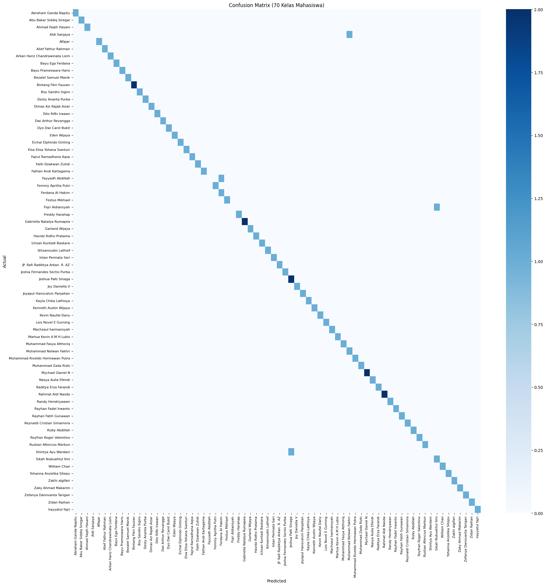

# Deep Learning (IF25-40401) Project
# NeoFace - Face Recognition for Student Attendance 


Proyek ini dibuat sebagai bagian dari Tugas Besar Mata Kuliah Pembelajaran Mendalam (IF25-40401) di Program Studi Teknik Informatika, Institut Teknologi Sumatera.  
Topik utama tugas adalah membangun sistem presensi mahasiswa berbasis *Face Recognition* menggunakan model *Deep Learning end-to-end*.

---

## Daftar Anggota Kelompok

| Nama | NIM | Profil GitHub |
|------|------|----------------|
| Bintang Fikri Fauzan | 122140008 | https://github.com/bintangfikrif |
| Ferdana Al Hakim | 122140012 | https://github.com/luciferdana |
| Zidan Raihan | 122140100 | https://github.com/zidbytes |


---

## Struktur Direktori Proyek

```
Face-Recognition/
│
├── data_raw/ # Dataset asli 
├── data_processed/ # Dataset hasil preprocessing
├── notebooks/ # Notebook training 
├── models/ # Model hasil training
├── app/ # Aplikasi demo 
├── utils/ # Helper functions
├── requirements.txt # Dependency library
└── README.md # Dokumentasi project
```

## Dataset

Dataset diperoleh dari foto mahasiswa yang diunggah melalui Google Form.  
Setiap mahasiswa mengunggah minimal 5 foto dengan ketentuan:
- Wajah terlihat jelas  
- Tidak tertutup masker/kacamata hitam  
- Pose bebas  
- Background bebas  

## Preprocessing

Data raw yang sudah dikumpulkan dalam satu folder `data_raw/` selanjutnya dilakukan proses cropping wajah menggunakan MediaPipe dan disimpan dalam folder `data_processed/`. Proses ini dilakukan dengan menggunakan script `utils/face_crop.py`.

## Model yang digunakan

Pada project ini, digunakan model **InceptionResnetV1** (pretrained VGGFace2) sebagai model utama untuk klasifikasi wajah. Model ini dipilih karena performanya yang *state-of-the-art* dalam pengenalan wajah dan arsitekturnya yang efisien.

### Hyperparameter
- **Batch Size**: 16
- **Learning Rate**: 1e-3
- **Epoch**: 20 (per Fold)
- **Image Size**: 160x160
- **Optimizer**: Adam
- **Weight Decay**: 1e-3
- **Scheduler**: ReduceLROnPlateau
- **Loss Function**: CrossEntropyLoss (Label Smoothing 0.1)

### K-Fold Cross Validation

Untuk memastikan validitas model dan mengatasi keterbatasan jumlah data (*few-shot learning*), kami menggunakan metode **Stratified K-Fold Cross Validation** dengan `k=4`. Pendekatan ini memastikan bahwa setiap sampel data pernah digunakan sebagai data validasi, sehingga evaluasi performa model menjadi lebih bias-free dan robust.

### Hasil Training

**Training History (Loss & Accuracy)**


Grafik di atas menunjukkan penurunan loss yang stabil dan peningkatan akurasi seiring berjalannya epoch. Penggunaan *transfer learning* dengan *freeze backbone* terbukti efektif untuk mempercepat konvergensi.

**Confusion Matrix**


Confusion matrix menunjukkan kemampuan model dalam membedakan antar kelas mahasiswa dengan sangat baik, dengan mayoritas prediksi berada di diagonal utama (benar).

Hasil Accuracy, Precision, Recall, dan F1-Score dapat dilihat pada tabel berikut:

| Metric | Value |
|--------|-------|
| Accuracy | 94.67% |
| Precision | 91.7% |
| Recall | 94.67% |
| F1-Score | 92.8% |

## Aplikasi Demo

### Deployment

Aplikasi demo dapat dijalankan dan di deploy dengan menggunakan Streamlit. 

### Alur Aplikasi
1. **Inisiasi & Pemuatan Model**. Saat aplikasi dijalankan, ia memuat model Deep Learning yang telah dilatih dari folder `models/`. Aplikasi juga memuat mapping kelas yang diperlukan untuk mengetahui nama mahasiswa mana yang sesuai dengan hasil klasifikasi model. Aplikasi didesain agar pengguna dapat memilih model .pth yang berbeda secara dinamis melalui sidebar.

2. **Input Pengguna**. Pengguna mengunggah sebuah foto ke dalam antarmuka aplikasi Streamlit.

3. **Deteksi Wajah**. Setelah foto diunggah, aplikasi akan menggunakan MTCNN (Multi-task Cascaded Convolutional Networks) untuk mendeteksi wajah yang ada pada gambar tersebut.

4. **Klasifikasi (Inferensi)**. Bagian wajah yang terdeteksi kemudian diteruskan ke model Deep Learning yang telah dimuat (sesuai pilihan pengguna). Model melakukan inferensi klasifikasi wajah untuk menentukan identitas mahasiswa yang bersangkutan.

5. **Output Hasil**. Aplikasi akan menampilkan hasil prediksi. Hasil tersebut mencakup menampilkan bounding box di sekitar wajah yang terdeteksi. Aplikasi juga menampilkan label prediksi, yang berisi Nama Mahasiswa beserta nilai Confidence (tingkat keyakinan model).
